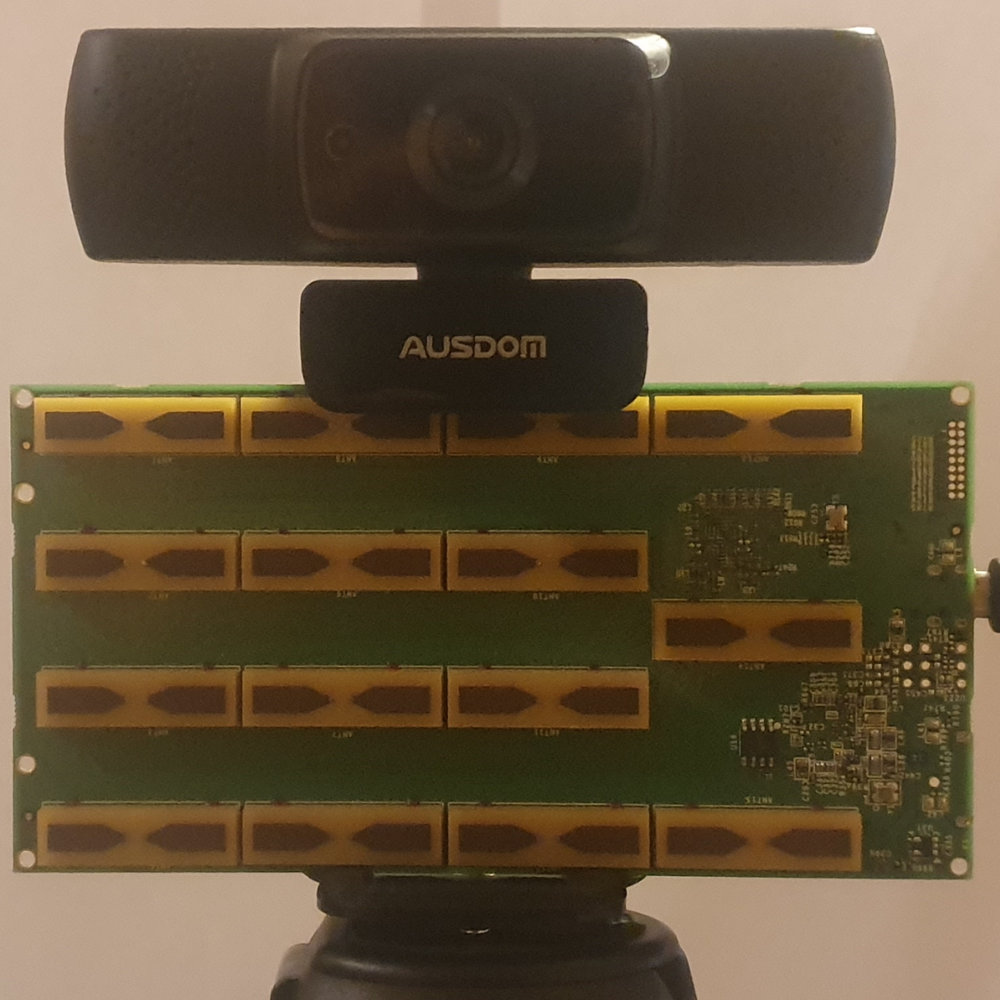
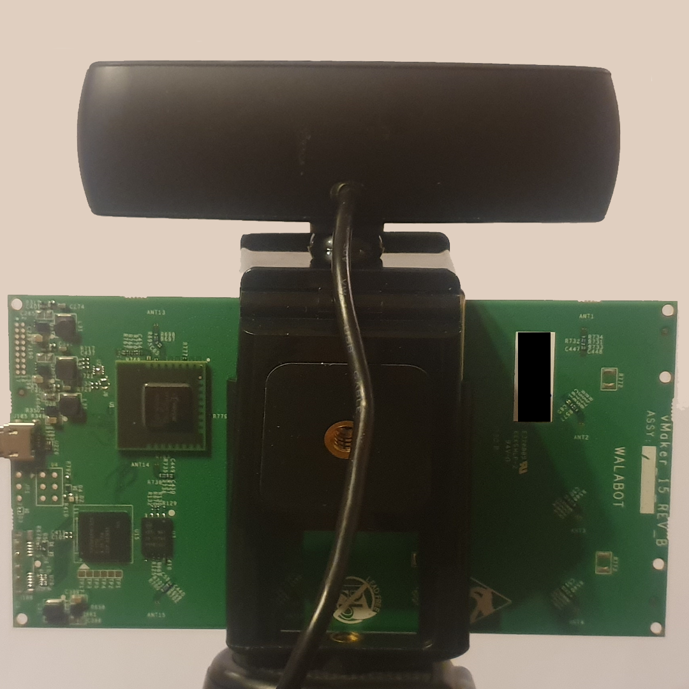
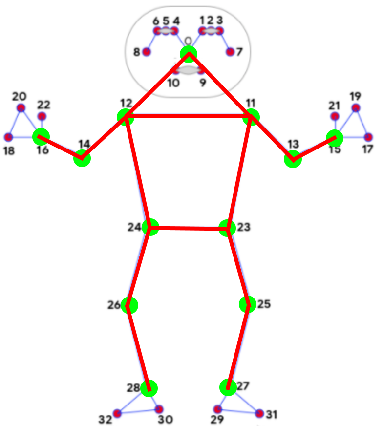
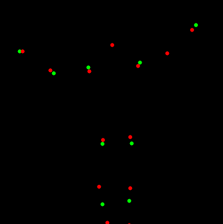
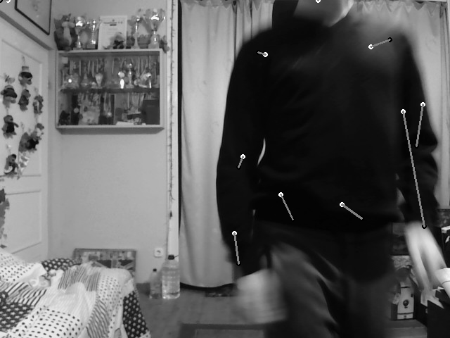
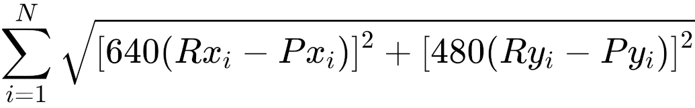

# See-Thru

### This repo contains applications used by our project, which aims to create multiple machine learning applications based on radar sensor data. Specifically, it uses the [walabot](https://walabot.com/makers) radar.

* Data collection works on Windows. WalabotSDK is not maintained for Linux.
* Data processing applications work on Windows, Linux and MacOS.

## Setup

1. Install the [WalabotSDK](https://walabot.com/getting-started) (has problems running on Linux, so using the Windows version is recommended).

2. Install dependencies using pip (`requirements.txt`)

3. For data collection run `measure.py`

4. For data exploration run `app.py`  

via [PySimpleGUI](https://github.com/PySimpleGUI/PySimpleGUI)

## Data Collection

### Hardware used

- Ausdom AF640 (Webcam)
- Vayyar Walabot Creator (Radar)

### Experiment setup

    
    

> Use the `measure.py` script to connect to the webcam and the radar and start data collection. 

### Storage

Dataset size is 138 Mb / 1000 samples. Meaning a dataset consisting of 1 million samples will take 135 GBs of storage space.

## Data Processing

Used pose detection method is [Media Pipe Pose](https://google.github.io/mediapipe/solutions/pose.html). Unnecessary keypoints are discarded (33 -> 13).

A way to improve the collected data is to fill in the blank keypoints with a keypoint generated by another NN. This is not a hard task, as there is no need to collect new data (altough getting more data is always good), because you can just process the currently collected keypoints by filtering random keypoints out to train a key point prediction improver NN. (See implementation in pose_missing.py and predict_pose.py)

Green dots show input pose. Red dots show predicted pose. Note that we can ignore the predictions of already known keypoints.

## Modeling

Training results after a couple of minutes.

Loss function:

Where: N is number of keypoints; Rx,y are real keypoints; Px,y are predicted keypoints. 

Model can be improved by building a better dataset (below).

How to improve dat
* More samples
* Filter samples (the image above was trained with faulty data)
* Generalized (measurements were taken from a single angle)